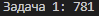
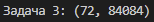

# Python. Лабораторная работа №2
Расчётные задачи. Itertools

##  Условия задач
1. **Коды Ивана**: Нужно найти количество 5-буквенных комбинаций из букв И, В, А, Н с хотя бы одной "И".
2. **Система счисления**: Подсчитать нули в восьмеричной записи выражения `7 * 512^120 - 6 * 64^100 + 8^210 - 255`.
3. **Делители**: Найти число в диапазоне [84052; 84130] с максимальным количеством делителей.

##  Решение
### Задача 1: Коды Ивана
```python
import itertools

def count_codes():
    letters = ['И', 'В', 'А', 'Н']
    total = 0
    for code in itertools.product(letters, repeat=5):
        if 'И' in code:
            total += 1
    return total
```
**Результат**: 

### Задача 2: Система счисления
```python
def count_zeros_in_octal():
    expression = 7 * (512 ** 120) - 6 * (64 ** 100) + (8 ** 210) - 255
    octal = oct(expression)[2:]
    return octal.count('0')
```
**Результат**: 

### Задача 3: Делители
```python
def count_divisors(n):
    count = 0
    for i in range(1, int(n ** 0.5) + 1):
        if n % i == 0:
            if i == n // i:
                count += 1
            else:
                count += 2
    return count
def find_number_with_max_divisors(start, end):
    max_divisors = -1
    result_number = start
    for num in range(start, end + 1):
        divisors = count_divisors(num)
        if divisors > max_divisors or (divisors == max_divisors and num < result_number):
            max_divisors = divisors
            result_number = num
    return (max_divisors, result_number)
print("Задача 1:", count_codes())
print("Задача 2:", count_zeros_in_octal())
print("Задача 3:", find_number_with_max_divisors(84052, 84130))
```
**Результат**: 

### Ссылки на используемые материалы:
https://habr.com/ru/companies/otus/articles/529356/
https://docs.python.org/3/library/itertools.html
https://proglib.io/p/iteriruemsya-pravilno-20-priemov-ispolzovaniya-v-python-modulya-itertools-2020-01-03