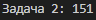

# Python. Лабораторная работа №2
Расчётные задачи. Itertools

##  Условия задач
1. **Коды Ивана**: Нужно найти количество 5-буквенных комбинаций из букв И, В, А, Н с хотя бы одной "И".
2. **Система счисления**: Подсчитать нули в восьмеричной записи выражения `7 * 512^120 - 6 * 64^100 + 8^210 - 255`.
3. **Делители**: Найти число в диапазоне [84052; 84130] с максимальным количеством делителей.

##  Решение
### Задача 1: Коды Ивана
```python
import itertools

def count_codes():
    letters = ['И', 'В', 'А', 'Н']
    return sum(1 for code in itertools.product(letters, repeat=5) if 'И' in code)
```
**Результат**: 

### Задача 2: Система счисления
```python
def count_zeros_in_octal():
    expression = 7 * (512 ** 120) - 6 * (64 ** 100) + (8 ** 210) - 255
    return oct(expression)[2:].count('0')
```
**Результат**: 

### Задача 3: Делители
```python
def count_divisors(n):
    return sum(2 for i in range(1, int(n ** 0.5) + 1) if n % i == 0) - (1 if int(n ** 0.5)**2 == n else 0)
```
**Результат**: 

### Ссылки на используемые материалы:
https://habr.com/ru/companies/otus/articles/529356/
https://docs.python.org/3/library/itertools.html
https://proglib.io/p/iteriruemsya-pravilno-20-priemov-ispolzovaniya-v-python-modulya-itertools-2020-01-03