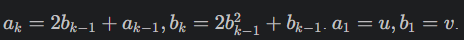
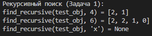
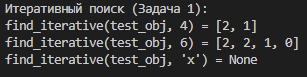
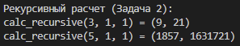
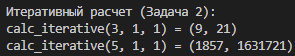

# Python. Лабораторная работа №3
Рекурсия

##  Условия задач
1. **Функция для поиска значения в сложном объекте**: Нужно написать функцию, используя рекурсию, которая ищет значения в сложном объекте и написать функцию, не используя рекурсию, выполняющую ту же цель.
2. **Функция для расчета уравнения **: Нужно написать функцию, используя рекурсию, которая расчитывает уравнение и написать функцию, не используя рекурсию, выполняющую ту же цель.

##  Решение
### Задача 1: Функция для поиска значения в сложном объекте
```python
test_obj = [1, 2, [3, 4, [5, [6, []]]]]
#Первая задача рекурсией
def find_recursive(obj, target, index=None):
    if index is None:
        index = []
    if obj == target:
        return index.copy()
    if isinstance(obj, (list, tuple)):
        for i, item in enumerate(obj):
            index.append(i)
            result = find_recursive(item, target, index)
            if result is not None:
                return result
            index.pop()
    return None

#Первая задача без рекурсии
def find_iterative(obj, target):
    stack = [(obj, [])]
    while stack:
        current_obj, path = stack.pop()
        if current_obj == target:
            return path
        if isinstance(current_obj, (list, tuple)):
            for i in reversed(range(len(current_obj))):
                stack.append((current_obj[i], path + [i]))
    return None
```
#### Результат с рекурсией: 
#### Результат без рекурсии: 

### Задача 2: Функция для расчета уравнения 
```python
#Вторая задача с рекурсией
def calculate_recursive(k, u, v):
    if k == 1:
        return (u, v)
    a_prev, b_prev = calculate_recursive(k - 1, u, v)
    a_k = 2 * b_prev + a_prev
    b_k = 2 * (b_prev ** 2) + b_prev
    return (a_k, b_k)

#Вторая задача без рекурсии
def calculate_iterative(k, u, v):
    a, b = u, v
    for _ in range(2, k + 1):
        a_new = 2 * b + a
        b_new = 2 * (b ** 2) + b
        a, b = a_new, b_new
    return (a, b)
```
#### Результат с рекурсией: 
#### Результат без рекурсии: 

##### Ссылки на используемые материалы:
1. https://youtu.be/IJDJ0kBx2LM
2. https://proglib.io/p/samouchitel-po-python-dlya-nachinayushchih-chast-13-rekursivnye-funkcii-2023-01-23
3. https://habr.com/ru/articles/337030/