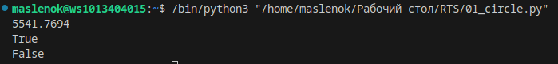
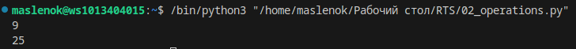
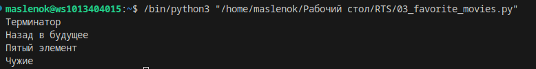
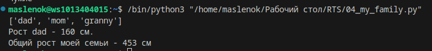
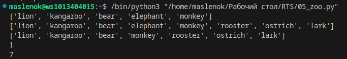
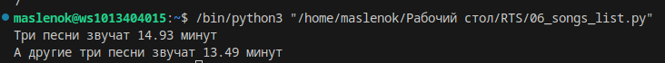
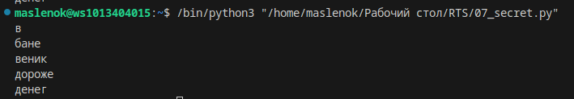
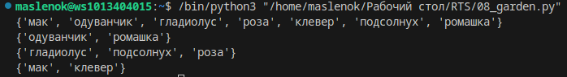
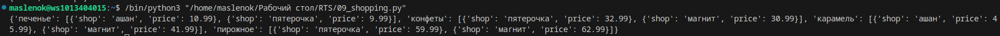

# Лабораторная работа №1. Знакомство.

## Задание
1. Дан словарь координат городов. Нужно составить словарь расстояний между ними.
2. Дано значение радиуса круга. Вывести на консоль значение площади этого круга с точностью до четырех знаков после запятой. Даны координаты точки point_1. Если она лежит внутри круга с этим радиусом - вывести true, иначе - false. Аналогично для точки point_2 с другими координатами.
3. Расставить знаки операций "+", "-", "*" и скобки между числами "1 2 3 4 5" так, чтоб получилось число "25".
4. Есть строка с перечислением фильмов. Вывести на консоль с помощью индексации строки, последовательно: первый, последний, второй, второй с конца. Выводить без запятой. Использовать готовые функции нельзя - пользоваться только срезами. 
5. Создать два списка: 1) семья, 2) рост членов семьи. Вывести на консоль рост отца и общий рост семьи как сумму рсотов всех членов семьи.
6. Дан список животных в зоопарке. Внести в определенное место в списке новый элемент и вывести на консоль. Добавить элементы из другого списка в конец первого и вывести. Убрать определенный элемент из первого списка. Вывести индексы определенных элементов списка. 
7. Есть список песен. Вывести общее время звучания трех определенных песен, округлить до сотых. Повторить то же самое с другим списком.
8. Расшифровать сообщение по ключу. 
9. Создать множество и сотворить с ним всякое.
10.  Создать словарь самых низких цен на продукты.
11. Вывести стоимость каждого вида товара на складе не используя циклы.
## Результаты вычислений
1.
2.
3.
4.
5.
6.
7.
8.
9.
10.
11.
## Список использованных источников:
1. https://doka.guide/tools/markdown/
2. https://github.com/still-coding/report_demo/
3. https://docs.python.org/3/tutorial/
4. https://clck.ru/MfEMS
